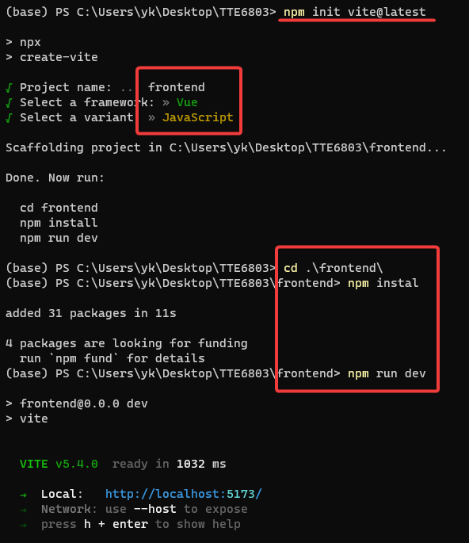
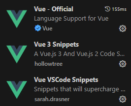
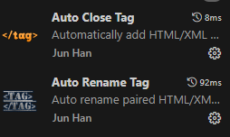

## 环境配置
1. 安装npcap-1.79.exe驱动 [#4171](https://github.com/secdev/scapy/issues/4171)
2. 创建python环境
```shell
$ conda create -n as6803tte python=3.12.4 -y
$ conda activate as6803tte
$ conda install scapy==2.5.0 sqlalchemy==2.0.30 -y
$ conda install flask==3.0.3 flask-cors==3.0.10 flask-socketio==5.3.1 -y
```

> 通过conda安装scapy，目前只能安装2.4.5版本，运行会出现兼容性问题，需要通过pip升级为2.5.0
> ```shell
> $ pip install --upgrade scapy
> ```


3. 搭建Vue环境
  首先安装node，安装node-v20.16.0-x64.msi

  查询是否安装成功

  ```shell
  $ node -v
  $ npm -v
  ```

  修改镜像源

  ```shell
  $ npm config set registry=https://registry.npmmirror.com/
  $ npm config get registry
  ```

4. 创建vue项目，

   ```shell
   $ npm init vite@latest
   ```

   

   ```shell
   $ npm install vue-socket.io socket.io-client
   ```
## VSCode开发

推荐扩展安装

|  |  |
| :--------------------------------------------: | :----------------------------------------------------------: |


## 其他
1. vue-socket.io以及vue-socket.io-extend只支持Vue2,作者已不再更新，使用Vue3+Socket.io方案